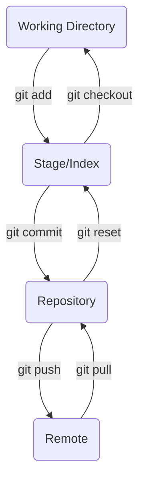
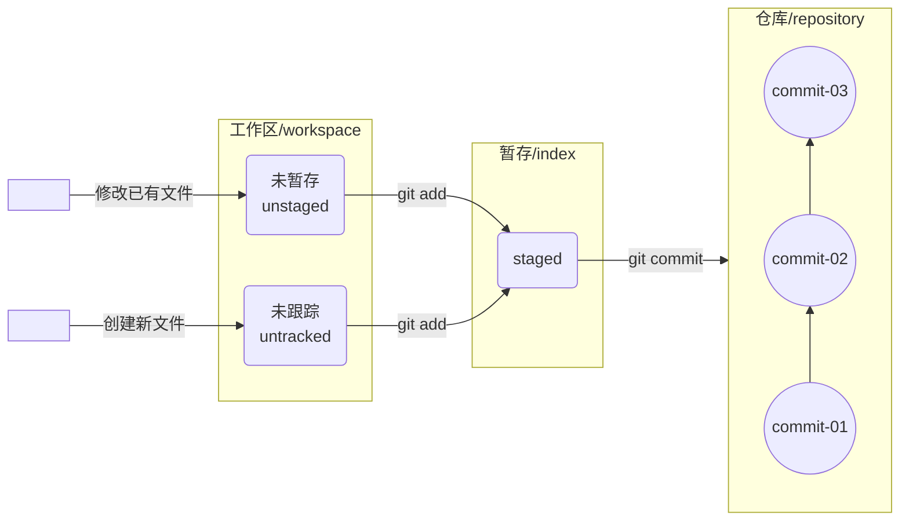

# Git

> Git是目前世界上最先进的分布式版本控制系统

!!! info "官网"
    [git-scm.com](https://git-scm.com/)

---

## Git环境配置

### 显示配置信息

所有的配置文件都保存在本地

- 系统级配置在Git安装目录下的`etc/gitconfig`
- 用户级配置在用户目录`~/.gitconfig`

```bash
git config [--system|--global] --list ## 显示[系统|全局]所有配置信息
```

### 配置用户信息

```bash
git config --global user.name "Username" ## 配置用户名称为Username
git config --global user.email "User@email.com" ## 配置用户邮箱为User@email.com
```

---

## Git工作区域

- 本地仓库
    - 工作目录 Working Directory，当前存放代码的位置
    - 暂存区 Stage/Index，临时存放你的改动，事实上只是一个文件，保存即将提交到文件列表信息
    - 资源库 Repository，安全存放数据的位置，里面有提交的所有版本的数据，其中HEAD文件指向最新放入仓库的版本
- 远程仓库 Remote，托管代码的服务器

关系如下：



本地的三个工作区域：



---

## Git基本操作

### 忽略文件

有些时候不想将某些文件纳入版本控制中，可以在主目录下建立`.gitignore`文件

文件规则：

```gitignore title=".gitignore"
## 注释
## 所有的忽略都是递归多级忽略，包括当前目录和多级目录中的
Name ## 忽略Name文件或Name目录
     ## 此时当前目录下的所有Name文件夹和文件都会被递归忽略
     ## 例：./Name/ && ./src/Name && src/utils/Name
FolderName/ ## 忽略FolderName/目录
!FolderName ## 不忽略的内容，例外规则
*.txt ## 忽略所有.txt文件
?.md ## 忽略所有名字为 一个字符.md的文件
*.[io] ## 忽略所有.i 和 .o文件
src/**/filename ## 忽略多级目录中的filename文件
```

### 创建本地仓库

在当前目录本地搭建项目仓库时使用，生成一个`.git`文件夹

```bash
git init
```

### 查看文件状态

版本控制中文件存在4种状态

- Untracked：未跟踪，在项目文件夹中但并未加入到git库，不参与版本控制
- Unmodify：未修改，即版本库中的文件内容与文件夹中完全一致
- Modified：已修改
- Staged：暂存

```bash
git status [filename] ## 查看文件状态
```

### 提交文件

```bash
git add <filename> ## 提交文件filename至暂存区
git add .
git add --all ## 提交所有当前目录包括子目录下的改动文件至暂存区
                ## 这个命令还会把删除的文件提交进去，即提交仓库时删除同样的文件
                ## 如果不想删除文件可以使用上一条

git commit -m "MESSAGE" ## 提交暂存区中的内容到本地仓库，附上消息：MESSAGE
git commit --amend ## 修改上次提交的注释消息
```

### 查看日志

```bash
git log [filename | --all] [--pretty=oneline] [--abbrev-commit] [--graph]
## [filename | --all]：不添加默认显示全部文件日志
## [--pretty=onelinen]：将提交信息显示为一行
## [--abbrev-commit]：输出commitID更简短
## [--graph]：显示为图的形式

git reflog ## 查看所有历史记录，包括回退后删除的版本信息
```

可以看到哈希值（*commitID*），提交仓库分支，作者，提交日期，注释信息

!!! note "注意"
    `HEAD`指向的表示为当前所在分支

!!! tip "实用小技巧"
    在Bash中使用`alias`或`abbr`方法定义`git-log = git log --pretty=oneline --abbrev-commit --all --graph --decorate`以快捷查看简洁日志

### 版本回退

```bash
git reset [--soft | --mixed | --hard] <commitID> ## 回退至指定版本，默认为--mixed
## [--soft]：仅移动HEAD指针，缓存区与工作区不变
## [--mixed]：重置缓存区文件，历史记录与上一次提交一致，工作区不变
## [--hard]：暂存区与工作区都回退
```

### 删除文件与恢复

```bash
git rm <filename> ## 删除文件，放回暂存区
                    ## 这个操作同时也会触发在工作目录删除该文件，即rm filename
git commit -m "delete" ## 重新提交

git reset [--mixed]## 将删除的文件从暂存区中丢弃

git checkout <filename> ## 放弃对文件filename的缓存区操作
```

---

## 分支操作

几乎所有的版本控制系统都以某种形式支持分支

使用分支意味着把你的工作从开发主线上分离开进行功能开发，以免影响主线的开发

在开发中，一般有以下分支使用原则与流程：

- master（生产）分支
  
    线上分支，主分支，中小规模项目作为线上运行的应用对应的分支

- develop（开发）分支
  
    从master创建的分支，一般为开发部门的主要开发分支，如果没有其它并行开发不同期上限要求，都可以在此进行开发

    阶段开发完成后，合并到master分支，准备上线

- feature/xxxx分支
  
    从develop创建的分支，一般是同期并行开发，但不同期上线时创建的分支，分支上的研发任务完成后合并到develop分支

- hotfix/xxxx分支
  
    从master派生的分支，一般作为线上bug修复使用，修复完成后需要合并到master，test，develop分支

- 其它分支，如test（代码测试）分支，pre（预上线）分支等等

### 查看

```bash
git branch [-a] [-r] [-v | -vv] ## 查看当前分支
## [-r]：查看远程分支
## [-a]：查看所有分支
## [-v | -vv]：显示分支commitID和commit内容，-vv显示与之关联的远程分支信息

git diff <branch1> <branch2> <filename> ## 查看不同分支的文件差
```

### 创建

新创建的分支会有当前所有其它分支的提交，而各分支的提交互不干扰

```bash
git branch <branchname> ## 创建本地分支
```

### 切换

```bash
git checkout [-b] <branchname> ## 切换到分支branchname
## [-b]：创建并切换
```

### 合并

```bash
git merge <branchname> ## 合并分支branchname的提交到当前分支
```

#### 快进模式

!!! example "快进模式"
    创建分支*dev01*，并在*dev01*分支上创建文件test.txt，并提交修改

    使用`git merge dev01`会出现`Fast-forward`

    使用`git log`会在该次版本后跟随`fast-forwarded`

Git的智能之处，即快进模式，更快捷方便进行分支合并

#### 合并冲突

!!! warning "注意"
    如果在不同分支上同时修改同一文件的同一行后进行提交，使用`git log`会显示冲突，使用`git merge`会出现冲突

解决冲突的方法：

1. 处理文件中冲突的地方
2. 将解决完冲突的文件加入暂存区
3. 提交到仓库

??? example "解决分支冲突"
    解决*dev01*分支和*dev02*分支的冲突
    ```bash
    root@localhost WorkingDirectory MINGW64 (dev01) ## 显示dev01中的内容
    $ cat test.txt
    helloworld
    
    root@localhost WorkingDirectory MINGW64 (dev01) ## 切换到dev02
    $ git checkout dev02
    
    root@localhost WorkingDirectory MINGW64 (dev02) ## 显示dev02中的内容
    $ cat test.txt
    HELLOWORLD
    
    root@localhost WorkingDirectory MINGW64 (dev02) ## 尝试merge
    $ git merge dev01
    Auto-merging test.txt
    CONFLICT (add/add): Merge conflict in test.txt
    Automatic merge failed; fix conflicts and then commit the result.
    
    root@localhost WorkingDirectory MINGW64 (dev02|MERGING) ## 查看冲突内容
    $ cat test.txt
    <<<<<<< HEAD
    HELLOWORLD
    =======
    helloworld
    >>>>>>    dev01
    
    root@localhost WorkingDirectory MINGW64 (dev02|MERGING) ## 修改内容
    $ vim test.txt
    
    root@localhost WorkingDirectory MINGW64 (dev02|MERGING) ## 查看修改后的内容
    $ cat test.txt
    HeLlOwOrLd
    
    root@localhost WorkingDirectory MINGW64 (dev02|MERGING) ## 提交
    $ git add .
    
    root@localhost WorkingDirectory MINGW64 (dev02|MERGING) ## 提交
    $ git commit -m "Conflict solved"
    [dev02 4742251] conflict solved
    
    root@localhost WorkingDirectory MINGW64 (dev02) ## 冲突解决
    $ cat test.txt
    HeLlOwOrLd
    ```

### 删除

```bash
git branch -d <branchname> ## 不能删除当前分支
git branch -D <branchname> ## 强制删除
```

### 改名

```bash
git branch -m <oldname> <newname> ## 修改分支名称
```

---

## 远程仓库

远程仓库通常有很多中，比较有名的是Github，Gitlab，Gitee

!!! note "远程仓库"
    一般来说，一个远程仓库对应一个本地仓库

### 添加

```bash
git remote add <remoteName> <remotePath> ## 默认远端仓库名remoteName=origin，取决于远端服务器设置
```

!!! tip "URL"
    远程仓库的路径通常为URL：`git@github.com:User/Repository.git`可以在github上查看

??? example "添加远程仓库"
    作者1EEExp3rt添加远程仓库*git_test*
    ```bash
    git remote add origin git@github.com:1EEExp3rt/git_test.git
    ```

### 查看

```bash
git remote [-v] [show <remoteName>]## 查看远程仓库名称
## [-v]：查看权限信息
## [show <remoteName>]：查看远程仓库详细信息
```

### 推送

```bash
git push [<remoteName> <localBranch>[:<remoteBranch>]] [--set-upstream | -u] [-f]
## [<remoteName> <localBranch>[:<remoteBranch>]]：分支名相同时可以只用本地名
## [--set-upstream | -u]: 二者等价，推送到远程仓库的同时建立起和远程分支的关联关系
## [-f]：强制推送本地至云端
## [-u]：将本地仓库分支与远程仓库分支一起合并，否则只合并当前分支
```

!!! example "推送至远程"
    1. 如果当前分支和远程分支已经关联，则可以直接省略所有参数，直接使用`git push`即可
    2. `git push origin master:master`
    3. `git push origin master`

!!! tip "查看远程分支信息"
    使用`git branch -vv`查看与当前分支关联的远程分支信息

### 克隆

```bash
git clone [-b <branchName>] <repoPath> [localPath] ## 默认拉取main分支
## <repoPath>：仓库路径，通常是URL
## [localPath]：克隆目标路径，默认为当前目录
## [-b <branchName>]：拉取branchname分支
```

### 抓取

克隆命令并不会很频繁使用，否则获取远程更新的工作量过大

一般对于同一个仓库只需要一次`git clone`

使用抓取命令`git fetch`将远程仓库的更新抓取到本地

!!! warning "注意"
    `git fetch`**不会进行合并**

```bash
git fetch [remoteName] [branchName] ## 默认抓取全部远程分支
```

### 拉取

拉取命令`git pull`就是将远程仓库的更新拉到本地并**自动进行合并**

!!! tip "你有没有注意到"
    `git pull` == `git fetch` + `git merge`

```bash
git pull [remoteName] [branchName] ## 默认拉取全部远程分支
```

#### 合并冲突

`git pull`包含`git merge`，因此合并时如果出现同一文件的同一行被修改会出现合并冲突，解决方式与本地合并相同

!!! warning "注意"
    因此，在本地修改完需要推送到远程时需要先`git pull`拉取远程仓库的提交以查看远程是否有新的提交，经过本地合并并解决冲突后才能`git push`推送到远程

### 删除

```bash
git push <remoteName> --delete <remoteBranch> ## 删除远程分支
```

---

## 当前工作状态操作

在当前工作区修改了文件或其他功能时，想要切换或者创建其它分区是不可能的，git会终止你的操作以防当前工作区内容丢失

!!! note "Stash"
    `git stash`以栈形式存储工作状态

```bash
git stash ## 保存当前工作状态
git stash list ## 查看当前存储了多少工作状态

git stash pop ## 恢复到存储的工作状态，同时删除列表
git stash apply ## 恢复第一个状态，不删除列表
git stash apply listname ## 恢复listname状态
git stash drop listname ## 删除指定listname状态
git stash clear ## 移除所有list
git stash show ## 查看当前栈中最新保存的stash和当前目录差异
```

---

## 子模块

```bash
git submodule add github.com/User/Project/Submodule1.git
## 添加一个名为Submodule1的子模块到仓库中
## 添加时会添加仓库的最新版本，但子模块不会自动更新

## 首先进入子模块目录
git submodule init ## 子模块初始化
git submodule update ## 子模块更新
```

---

## 使用ssh连接github

为了化简每次登录远程都需要账号密码的麻烦，可以使用ssh的公司密钥对进行连接

!!! tip "创建密钥对"
    如果本地已经存在ssh密钥对，可以直接使用

    如果本地没有，则使用以下命令创建sshkey：
    ```bash
    ssh-keygen -t rsa -C "User@email.com"
    ```

    生成的文件中，`id_rsa`是私钥，`id_rsa.pub`是公钥

1. 在GitHub上添加公钥`id_rsa.pub`
2. 登录验证

!!! tip "验证登录"
    使用以下命令验证是否成功绑定密钥对：
    ```bash
    $ ssh -T git@github.com
    Hi User! You've successfully authenticated, but GitHub does not provide shell access.
    ```
